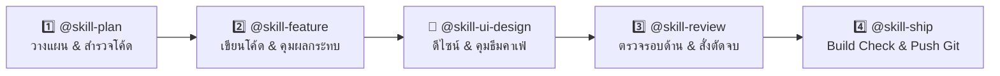

# 🌐 Bear Cafe Web — Agent Skills System Guide

คู่มือการใช้งาน **Agent Skills** สำหรับโปรเจกต์ **bear-cafe-web** (React, TypeScript, Vite, Tailwind CSS, Supabase & Edge Functions) ออกแบบมาให้เข้ากับวงจรการพัฒนาเว็บแดชบอร์ดอย่างเต็มประสิทธิภาพ โดยสามารถเรียกใช้ผ่านสัญลักษณ์ `@` ใน Antigravity IDE

---

## 🗺️ แผนผังลำดับขั้นตอนการทำงาน (Workflow Pipelines)

---

## 📚 สรุปชุดทักษะทั้ง 6 ของ bear-cafe-web

| Skill | หน้าที่หลัก | เมื่อไหร่ควรเรียกใช้ |
| :--- | :--- | :--- |
| **`@skill-plan`** | วางแผนสถาปัตยกรรม ออกแบบทางเลือก (Trade-offs) และตั้งสมมุติฐานก่อนแก้โค้ด | มีโจทย์ฟีเจอร์ใหม่ หรือต้องการวางโครงสร้างหน้าจอและฐานข้อมูล |
| **`@skill-feature`** | ลงมือพัฒนาฟีเจอร์ฝั่งเว็บ (Hooks, Services, Components) พร้อมสแกนผลกระทบข้ามระบบกับ Discord Bot | เขียนโค้ดตามแผน, เพิ่มตาราง/ฟังก์ชัน Supabase, สร้างระบบเชื่อมต่อข้อมูล |
| **`@skill-ui-design`** | ออกแบบ UI ให้ตรงอัตลักษณ์ Bear Cafe (Warm Dark, Cozy, ไม่ใช่ Corporate SaaS) และเรียนรู้สไตล์จากตัวอย่างโค้ดของผู้ใช้ | ปรับแต่งหน้าตา, แต่ง Tailwind, จัดการ Responsive หรือส่งตัวอย่าง `.tsx` ให้เรียนรู้ |
| **`@skill-debug`** | สืบหาต้นตอและแก้บั๊กหน้าเว็บ (React Lifecycle, Infinite loops, Supabase 401/403/RLS, Edge Functions) | เว็บค้าง, หน้าจอขาว, ดึงข้อมูลไม่ขึ้น, มี Error ใน Console |
| **`@skill-review`** | ออดิตความปลอดภัย ประสิทธิภาพ Supabase Egress, React Hooks และประกาศ "Good Enough" หยุดแก้เกินจำเป็น | เขียนโค้ดเสร็จแล้ว ต้องการตรวจทานความเรียบร้อยก่อนส่งงาน |
| **`@skill-ship`** | ตรวจความพร้อมก่อน Deploy (Build check, ล้าง `console.log`), สรุปรายงานสำหรับ Discord และทำ Git Commit/Push | งานเสร็จสมบูรณ์พร้อมขึ้น Production หรือ Push ขึ้น GitHub |

---

## 💡 จุดเด่นพิเศษ: ระบบเรียนรู้สไตล์ของ `@skill-ui-design`
* เมื่อคุณส่งไฟล์ตัวอย่าง `.tsx` หรือคู่มือ Markdown ที่ชอบเข้ามาในแชท สามารถบอกให้ `@skill-ui-design` ศึกษาและจดจำรูปแบบไปใช้ออกแบบ Component อื่น ๆ ได้ทันที เพื่อให้หน้าเว็บคงความน่ารัก อบอุ่น และเป็นเอกลักษณ์เดียวกันทั้งโปรเจกต์
