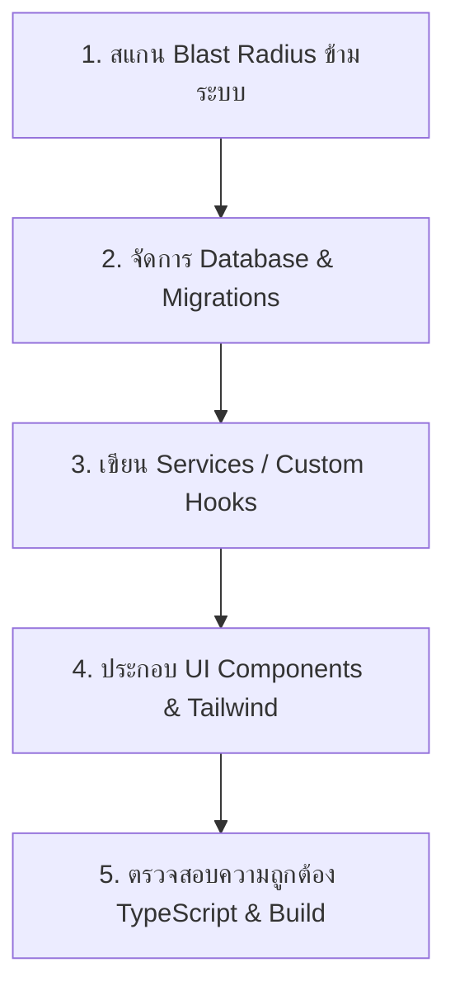

# ⚡ Web Feature Development (@skill-feature)

ใช้ Skill นี้เมื่อพร้อมลงมือพัฒนาฟีเจอร์ใหม่ ปรับโครงสร้างโค้ดหน้าเว็บ (Refactoring) หรือเขียนฟังก์ชันเชื่อมต่อ Supabase/Edge Functions โดยยึดหลัก Clean Architecture สำหรับ Frontend และคุม Blast Radius อย่างเข้มงวด

---

## 🎯 กฎเหล็กประจำ Skill (Core Rules)
1. **แยก Layer โค้ดให้ชัดเจน (Clean Frontend Architecture):**
   - **Data Fetching / Supabase Services:** รวมคำสั่ง Supabase queries หรือ Edge function calls ไว้ใน Hook หรือ Service Layer (เช่น `src/lib/` หรือ Custom Hooks)
   - **Presentation Components:** คอมโพเนนต์ UI ใน `src/components/` ต้องเน้นการรับ props และแสดงผล ไม่ควรยัด query หนัก ๆ ปนกับ JSX รกเกินไป
   - **Types & Interfaces:** กำหนด TypeScript types ให้ชัดเจน ห้ามใช้ `any` พร่ำเพรื่อ
2. **สแกนผลกระทบข้ามระบบ (Blast Radius Guard):**
   - ก่อนเปลี่ยนชื่อคอลัมน์ใน Supabase, แก้ไข RLS Policy หรือปรับ Edge Function payload ต้องตรวจสอบการใช้งานใน `d:\bearcafe-bot` ทุกครั้ง
   - หากมีการแก้ตารางที่บอทอ่าน/เขียน (เช่น `contracts`, `tag_warn`, `points`, `bee_settings`) ต้องแจ้งเตือนจุดที่กระทบในบอททันที
3. **คุม Supabase Query ประสิทธิภาพสูง:**
   - ใช้ `.select("id, name, ...")` เจาะจงเฉพาะฟิลด์ที่ต้องการเสมอ หลีกเลี่ยงการใช้ `.select("*")` กับตารางใหญ่
   - ใส่ Pagination หรือ `.limit()` เสมอเพื่อป้องกันข้อมูลล้นและการกินโควตา Egress
4. **ใส่ใจ Loading & Error States:**
   - ทุกส่วนที่มีการโหลดข้อมูลต้องมี Skeleton หรือ Spinner แสดงสถานะ
   - มี Error Boundary หรือ Toast แจ้งเตือนเมื่อการทำรายการล้มเหลว
5. **สุขอนามัยของ Imports และการ Refactor (Import Hygiene & Safe Refactor Guard):**
   - **ห้ามประกาศ Import ซ้ำ (No Duplicate Identifiers):** ก่อนเพิ่มตัวแปร/ไอคอนใหม่ (โดยเฉพาะจาก `lucide-react` หรือ `@/components/ui/`) ต้องตรวจค้นทั้งไฟล์เสมอว่าถูก import ไว้ก่อนแล้วหรือไม่ ป้องกัน `SyntaxError: Identifier 'X' has already been declared`
   - **ตรวจการใช้งานให้ครบทั้งไฟล์ก่อนลบ Import:** ก่อนลบ import ของคอมโพเนนต์เดิม (เช่น เมื่อแทนที่ด้วยคอมโพเนนต์ใหม่) ต้องสแกนค้นหาให้ทั่วทั้งไฟล์รวมถึงใน Dialog/Modal/Drawer ด้านล่าง ระวัง Regex grep พลาดจาก Windows CRLF (`\r\n`) หรือ JSX multiline ป้องกัน `ReferenceError: X is not defined`
   - **ตรวจ React Hooks ใน Named Imports เสมอ:** เมื่อมีการหยิบ Hook มาใช้ใหม่ เช่น `useMemo`, `useCallback`, `useRef`, `useState`, `useEffect` ต้องตรวจสอบบรรทัด `import React, { ... } from 'react'` ทันทีว่ามีชื่อ Hook นั้นอยู่ใน destructuring ครบถ้วน ห้ามอนุมานว่า TypeScript compiler ผ่านแล้วจะไม่พัง เพราะบาง config อาจมี ambient types ทำให้ `tsc` ไม่เตือน แต่เบราว์เซอร์และ Vite ESM runtime จะ throw `ReferenceError: useMemo is not defined` ทันทีที่เปิดหน้าเว็บ
   - **ตรวจ Typecheck ทุกรอบใน Batch Tasks:** หากปรับปรุง UI หรือแก้โค้ดหลายไฟล์พร้อมกันเป็นกลุ่ม ต้องรัน `npx tsc --noEmit` ทันทีหลังแก้แต่ละกลุ่ม ห้ามรอจนเสร็จทั้งหมด

---

## 🧭 ลำดับขั้นตอนการพัฒนา (Execution Flow)

### 1. สแกน Blast Radius ข้ามระบบ (Cross-System Impact Scan)
- ค้นหาคำค้นหา/ชื่อตารางใน `d:\bearcafe-bot` ก่อนลงมือเปลี่ยน schema
- ตรวจสอบว่า Discord Bot รัน RPC หรือ Function ตัวไหนอยู่บ้าง

### 2. จัดการ Database & Supabase (ถ้ามี)
- สร้าง migration ไฟล์ใน `supabase/migrations/` ให้เป็นระเบียบ
- ตั้งค่า Row Level Security (RLS) ให้รัดกุมเสมอ
- อัปเดต Edge Functions ใน `supabase/functions/` (ถ้าเกี่ยวข้อง)

### 3. พัฒนา Logic & Hooks
- สร้าง Hook จัดการ State, Cache หรือ Data fetching
- ดักจับ Error และส่งกลับ Error message ที่อ่านเข้าใจง่าย

### 4. พัฒนา UI Components
- ตกแต่งด้วย Tailwind CSS ตาม Design System ของร้านหมี
- รองรับการแสดงผลทั้งหน้าจอ Desktop และ Mobile (Responsive)

### 5. ตรวจสอบความสมบูรณ์
- รันตรวจ Typecheck หรือ Build เพื่อความมั่นใจว่าไม่มี Syntax/Type Error หลงเหลือ
