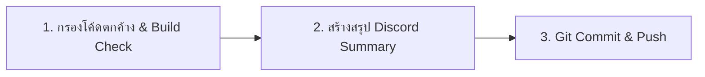

# 🚀 Web Pre-Deploy & Git Release Gatekeeper (@skill-ship)

ใช้ Skill นี้เป็นด่านตรวจสุดท้ายก่อน Deploy ขึ้น Production (Vercel / Supabase) เพื่อตรวจสอบว่าโค้ดไม่มี Error ตกค้าง พร้อมสรุปผลงานให้ทีมและจัดการ Git ให้เรียบร้อย

---

## 🧭 ลำดับขั้นตอนการทำงาน (Ship Pipeline)



---

### ขั้นตอนที่ 1: ตรวจสอบความสะอาดและความพร้อม (Pre-Deploy Checklist)
1. **คัดกรองโค้ดตกค้าง (Hygiene Audit):**
   - ตรวจสอบว่าไม่มี API keys, Tokens หรือ Secrets หลุดในโค้ด
   - ลบ `console.log` ที่ใช้ชั่วคราวในการ Debug ออกให้หมด
   - ไม่มีไฟล์ขยะหรือไฟล์ทดสอบหลงเหลือ
2. **ทดสอบการ Build และ Import จริง:**
   - **รันตรวจสอบ Import และตัวแปรตกหล่น:** `npm run check:imports` (ต้องผ่าน 0 errors ป้องกันปัญหา `ReferenceError: Dialog is not defined` ที่ทำให้หน้าจอดำ)
   - **รันคำสั่ง Build:** `npm run build` ต้องมั่นใจว่า Vite build สำเร็จ 100% โดยไม่มีข้อผิดพลาด

---

### ขั้นตอนที่ 2: สร้างสรุปผลงานสำหรับ Discord (Discord Summary)
สร้างข้อความสรุปผลงานที่จัดฟอร์แมตสวยงาม พร้อมให้คัดลอกไปโพสต์ในห้องอัปเดตงานของทีม:

```markdown
🌐✨ **[UPDATE] bear-cafe-web — ปล่อยอัปเดตระบบใหม่**
สรุปความคืบหน้าและการเปลี่ยนแปลงล่าสุด:

📦 **ฟีเจอร์และสิ่งที่ปรับปรุง:**
• 🌟 **Feature A:** รายละเอียดสั้นกระชับ เข้าใจง่าย
• 🎨 **UI Improvement:** ปรับปรุงความสวยงามและรองรับ Mobile
• 🛡️ **Security & Database:** อัปเดต RLS / Schema อย่างปลอดภัย

🛠️ **ผลการตรวจสอบ (Verification):**
- [x] ผ่านการทดสอบ Build บน Vite / TypeScript
- [x] ตรวจสอบสิทธิ์ RLS และไม่มีผลกระทบต่อ Discord Bot
- [x] ตรวจสอบการแสดงผล Responsive บนทุกขนาดหน้าจอ
```

---

### ขั้นตอนที่ 3: จัดการ Git Commit & Push
- สร้างข้อความ Commit ตามมาตรฐาน **Conventional Commits**:
  - `feat: ...` สำหรับฟีเจอร์ใหม่
  - `fix: ...` สำหรับการแก้บั๊ก
  - `style: ...` สำหรับการปรับแต่ง UI/CSS
  - `refactor: ...` สำหรับการจัดโครงสร้างโค้ด
- ยืนยันกับผู้ใช้ก่อนทำการ `git push`
