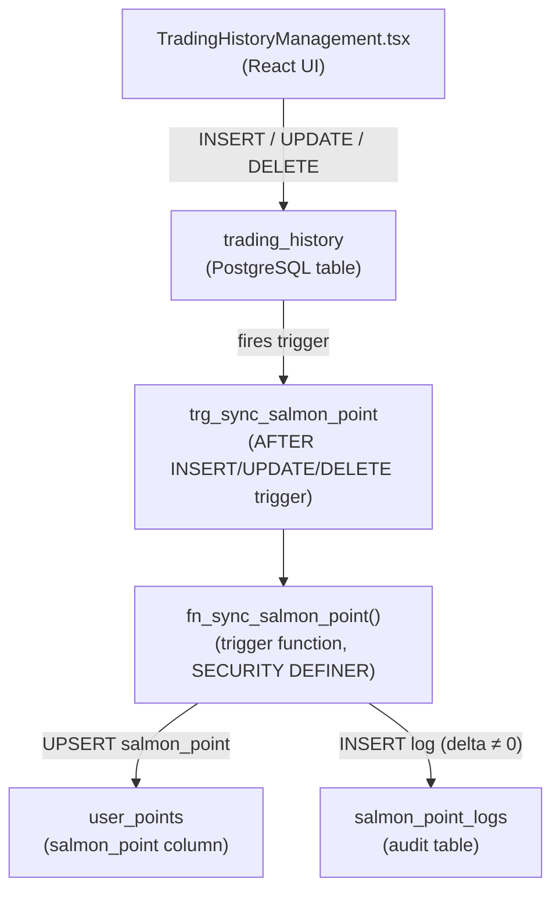

# Design Document: auto-salmon-point-on-bill

## Overview

Feature นี้ทำให้ระบบคำนวณและอัปเดต `salmon_point` โดยอัตโนมัติทุกครั้งที่มีการ INSERT, UPDATE หรือ DELETE บิลใน `trading_history` โดยใช้ PostgreSQL trigger เป็นแกนหลัก ไม่ต้องมีขั้นตอน manual จาก admin

สูตรคำนวณ: `salmon_point_delta = FLOOR(amount / 100)`

ขอบเขตของ feature:
- **Database layer**: migration เพิ่มคอลัมน์ + สร้างตาราง audit + trigger function
- **UI layer**: แสดง preview salmon_point ใน create-bill form เมื่อกรอก amount

---

## Architecture



**Design decisions:**

1. **Trigger-only approach** — ทุก logic อยู่ใน DB trigger ทำให้ไม่ว่า client ใด (UI, Apps Script, direct SQL) จะ insert/update/delete บิล salmon_point จะถูกอัปเดตเสมอ
2. **SECURITY DEFINER** — trigger function รันด้วย owner privileges เพื่อให้ write ไปยัง `user_points` และ `salmon_point_logs` ได้แม้ authenticated user จะไม่มีสิทธิ์ INSERT โดยตรง
3. **GREATEST(0, value)** — ใช้ clamp ใน trigger เพื่อป้องกัน salmon_point ติดลบ ร่วมกับ CHECK constraint บนตาราง
4. **Preview เป็น pure function ใน UI** — คำนวณ `Math.floor(amount / 100)` ใน React โดยตรง ไม่ต้องเรียก API

---

## Components and Interfaces

### 1. PostgreSQL Migration

**File:** `supabase/migrations/<timestamp>_add_salmon_point_feature.sql`

ประกอบด้วย:
- `ALTER TABLE user_points ADD COLUMN salmon_point INTEGER NOT NULL DEFAULT 0 CHECK (salmon_point >= 0)`
- สร้างตาราง `salmon_point_logs`
- สร้าง trigger function `fn_sync_salmon_point()`
- สร้าง trigger `trg_sync_salmon_point` บน `trading_history`
- RLS policies สำหรับ `salmon_point_logs`

### 2. Trigger Function: `fn_sync_salmon_point()`

```sql
-- Pseudocode logic
CREATE OR REPLACE FUNCTION public.fn_sync_salmon_point()
RETURNS trigger
LANGUAGE plpgsql
SECURITY DEFINER
SET search_path = public
AS $$
DECLARE
  v_discord_id   TEXT;
  v_old_sp       INTEGER;
  v_new_sp       INTEGER;
  v_delta        INTEGER;
  v_amount_before NUMERIC;
  v_amount_after  NUMERIC;
  v_change_type  TEXT;
  v_bill_id      UUID;
BEGIN
  -- Determine operation type and compute delta
  IF TG_OP = 'INSERT' THEN
    v_discord_id    := NEW.member_id;
    v_bill_id       := NEW.id;
    v_delta         := FLOOR(NEW.amount / 100);
    v_amount_before := NULL;
    v_amount_after  := NEW.amount;
    v_change_type   := 'insert';

  ELSIF TG_OP = 'UPDATE' THEN
    -- Only act when amount actually changed
    IF FLOOR(NEW.amount / 100) = FLOOR(OLD.amount / 100) THEN
      RETURN NEW;
    END IF;
    v_discord_id    := NEW.member_id;
    v_bill_id       := NEW.id;
    v_delta         := FLOOR(NEW.amount / 100) - FLOOR(OLD.amount / 100);
    v_amount_before := OLD.amount;
    v_amount_after  := NEW.amount;
    v_change_type   := 'update';

  ELSIF TG_OP = 'DELETE' THEN
    v_discord_id    := OLD.member_id;
    v_bill_id       := OLD.id;
    v_delta         := -(FLOOR(OLD.amount / 100));
    v_amount_before := OLD.amount;
    v_amount_after  := NULL;
    v_change_type   := 'delete';
  END IF;

  -- Skip if delta is zero
  IF v_delta = 0 THEN
    RETURN COALESCE(NEW, OLD);
  END IF;

  -- Read current salmon_point (0 if row doesn't exist yet)
  SELECT COALESCE(salmon_point, 0)
  INTO v_old_sp
  FROM public.user_points
  WHERE discord_id = v_discord_id;

  v_old_sp := COALESCE(v_old_sp, 0);

  -- Compute new value, clamped at 0
  v_new_sp := GREATEST(0, v_old_sp + v_delta);

  -- Upsert user_points
  INSERT INTO public.user_points (discord_id, salmon_point, points, max_cap, updated_at)
  VALUES (v_discord_id, v_new_sp, 0, 0, now())
  ON CONFLICT (discord_id) DO UPDATE
    SET salmon_point = v_new_sp,
        updated_at   = now();

  -- Write audit log
  INSERT INTO public.salmon_point_logs
    (discord_id, bill_id, change_type, old_salmon_point, new_salmon_point, delta,
     amount_before, amount_after, created_at)
  VALUES
    (v_discord_id, v_bill_id, v_change_type, v_old_sp, v_new_sp, v_new_sp - v_old_sp,
     v_amount_before, v_amount_after, now());

  RETURN COALESCE(NEW, OLD);
END;
$$;
```

### 3. React UI: Salmon Point Preview

เพิ่มใน `TradingHistoryManagement.tsx` ภายใน create-bill dialog ต่อจาก amount input:

```tsx
// Pure computation — no API call needed
const salmonPointPreview = useMemo(() => {
  const parsed = parseFloat(newBill.amount);
  if (!newBill.amount || isNaN(parsed) || parsed < 0) return null;
  return Math.floor(parsed / 100);
}, [newBill.amount]);

// JSX (rendered below the amount input)
{salmonPointPreview !== null && (
  <p className="text-xs text-muted-foreground mt-1">
    🐟 Salmon Point ที่จะได้รับ:{' '}
    <span className="font-semibold text-foreground">{salmonPointPreview}</span> แต้ม
  </p>
)}
```

---

## Data Models

### `user_points` (altered)

| Column | Type | Notes |
|---|---|---|
| `discord_id` | `TEXT` | PK |
| `points` | `INTEGER` | existing |
| `max_cap` | `INTEGER` | existing |
| `salmon_point` | `INTEGER` | **NEW** — `DEFAULT 0`, `CHECK (salmon_point >= 0)` |
| `updated_at` | `TIMESTAMPTZ` | existing |

### `salmon_point_logs` (new table)

| Column | Type | Notes |
|---|---|---|
| `id` | `UUID` | PK, `DEFAULT gen_random_uuid()` |
| `discord_id` | `TEXT` | NOT NULL — maps to `user_points.discord_id` |
| `bill_id` | `UUID` | NOT NULL — maps to `trading_history.id` |
| `change_type` | `TEXT` | NOT NULL — `'insert'`, `'update'`, or `'delete'` |
| `old_salmon_point` | `INTEGER` | value before the operation |
| `new_salmon_point` | `INTEGER` | value after the operation |
| `delta` | `INTEGER` | `new_salmon_point - old_salmon_point` (can be negative for deletes) |
| `amount_before` | `NUMERIC` | `OLD.amount` (NULL for inserts) |
| `amount_after` | `NUMERIC` | `NEW.amount` (NULL for deletes) |
| `created_at` | `TIMESTAMPTZ` | `DEFAULT now()` |

**Indexes:**
- `idx_salmon_point_logs_discord_id` on `(discord_id)`
- `idx_salmon_point_logs_bill_id` on `(bill_id)`
- `idx_salmon_point_logs_created_at` on `(created_at DESC)`

### RLS on `salmon_point_logs`

| Policy | Operation | Role | Condition |
|---|---|---|---|
| `"Admins can read salmon_point_logs"` | SELECT | `authenticated` | `jwt_has_page_access('users')` |
| `"Service role full access"` | ALL | `service_role` | `true` |

INSERT from authenticated users is **denied** (no INSERT policy for authenticated role). The trigger function runs as `SECURITY DEFINER` (owner), bypassing RLS entirely for writes.

---

## Correctness Properties

*A property is a characteristic or behavior that should hold true across all valid executions of a system — essentially, a formal statement about what the system should do. Properties serve as the bridge between human-readable specifications and machine-verifiable correctness guarantees.*

### Property 1: Insert delta matches formula

*For any* valid `amount` value inserted into `trading_history` for a given `member_id`, the `salmon_point` in `user_points` for that `discord_id` SHALL increase by exactly `FLOOR(amount / 100)` compared to its value before the insert.

**Validates: Requirements 3.1, 3.2, 3.3**

---

### Property 2: New user upsert on first bill

*For any* `discord_id` that does not yet exist in `user_points`, inserting a bill with `amount >= 100` SHALL create a row in `user_points` with `salmon_point = FLOOR(amount / 100)`.

**Validates: Requirements 3.3**

---

### Property 3: Update adjusts by delta of FLOOR values

*For any* bill update where `FLOOR(new_amount / 100) ≠ FLOOR(old_amount / 100)`, the resulting `salmon_point` SHALL equal `GREATEST(0, old_salmon_point + FLOOR(new_amount / 100) - FLOOR(old_amount / 100))`.

**Validates: Requirements 4.1, 4.2, 4.3**

---

### Property 4: Delete is the inverse of insert (round-trip)

*For any* `amount` and `discord_id`, inserting a bill and then deleting that same bill SHALL return `salmon_point` to its original value (or `0` if the original value minus the deduction would be negative).

**Validates: Requirements 5.1, 5.2, 5.3**

---

### Property 5: Non-negative invariant across all operation sequences

*For any* sequence of INSERT, UPDATE, and DELETE operations on `trading_history` for a single `member_id`, the `salmon_point` in `user_points` SHALL always be greater than or equal to `0` after every operation.

**Validates: Requirements 6.2, 6.3**

---

### Property 6: Audit log written for every non-zero delta

*For any* bill operation (insert, update, or delete) that produces a non-zero `FLOOR`-based delta, exactly one record SHALL be inserted into `salmon_point_logs` with the correct `discord_id`, `bill_id`, `change_type`, `old_salmon_point`, `new_salmon_point`, and `delta` fields.

**Validates: Requirements 2.2, 3.4, 4.4, 5.4**

---

### Property 7: Salmon point preview matches formula

*For any* numeric `amount >= 0` entered in the create-bill form, the displayed preview value SHALL equal `Math.floor(amount / 100)`.

**Validates: Requirements 8.1, 8.2**

---

## Error Handling

### Trigger-level errors

| Scenario | Handling |
|---|---|
| `member_id` is NULL on a bill | Trigger skips upsert (no discord_id to map to); no log written |
| `amount` is NULL | `FLOOR(NULL / 100)` returns NULL → delta treated as 0 → trigger exits early |
| Concurrent updates to same `discord_id` | PostgreSQL row-level locking on `user_points` during upsert prevents race conditions |
| `salmon_point_logs` INSERT fails | Trigger raises exception, rolling back the entire `trading_history` operation (atomic) |

### UI-level errors

| Scenario | Handling |
|---|---|
| `amount` field is empty | `salmonPointPreview` returns `null` → preview element not rendered |
| `amount` is non-numeric (e.g. "abc") | `parseFloat` returns `NaN` → preview not rendered |
| `amount` is negative | Preview not rendered (guard: `parsed < 0`) |

---

## Testing Strategy

### Unit Tests (Vitest)

Focus on the pure UI computation and edge cases:

- `salmonPointPreview` returns `Math.floor(amount / 100)` for valid amounts
- `salmonPointPreview` returns `null` for empty, non-numeric, or negative inputs
- Preview element is rendered when `salmonPointPreview !== null`
- Preview element is not rendered when `salmonPointPreview === null`

### Property-Based Tests (fast-check, minimum 100 iterations each)

The trigger function logic can be extracted into a pure TypeScript helper for property testing, or tested against a local Supabase instance.

Each property test is tagged with the design property it validates:

```
// Feature: auto-salmon-point-on-bill, Property 1: Insert delta matches formula
// Feature: auto-salmon-point-on-bill, Property 2: New user upsert on first bill
// Feature: auto-salmon-point-on-bill, Property 3: Update adjusts by delta of FLOOR values
// Feature: auto-salmon-point-on-bill, Property 4: Delete is the inverse of insert (round-trip)
// Feature: auto-salmon-point-on-bill, Property 5: Non-negative invariant across all operation sequences
// Feature: auto-salmon-point-on-bill, Property 6: Audit log written for every non-zero delta
// Feature: auto-salmon-point-on-bill, Property 7: Salmon point preview matches formula
```

**Property 1 & 2** — Generate random `amount` values (0–100,000) and random `discord_id` strings. Insert a bill, read `user_points`, verify `salmon_point` increased by `FLOOR(amount/100)`.

**Property 3** — Generate pairs `(old_amount, new_amount)` where `FLOOR` values differ. Insert a bill at `old_amount`, update to `new_amount`, verify the resulting `salmon_point` matches `GREATEST(0, prev + FLOOR(new/100) - FLOOR(old/100))`.

**Property 4** — Generate random `amount` and `discord_id`. Record initial `salmon_point`. Insert bill, then delete it. Verify `salmon_point` equals `GREATEST(0, initial - FLOOR(amount/100) + FLOOR(amount/100))` = initial (when initial >= 0, which it always is).

**Property 5** — Generate random sequences of 1–20 operations (insert/update/delete) for a single `discord_id`. After each operation, assert `salmon_point >= 0`.

**Property 6** — For each operation that produces a non-zero delta, query `salmon_point_logs` and verify exactly one new row with correct fields.

**Property 7** — Generate random floats in [0, 1,000,000]. Verify `Math.floor(amount / 100)` matches the preview. This is a pure function test, no DB needed.

### Integration / Smoke Tests

- Schema smoke: verify `user_points.salmon_point` column exists with correct type, default, and constraint
- Schema smoke: verify `salmon_point_logs` table exists with all required columns
- RLS smoke: verify admin can SELECT from `salmon_point_logs`
- RLS smoke: verify authenticated non-admin cannot INSERT into `salmon_point_logs`
- Migration smoke: verify trigger `trg_sync_salmon_point` exists on `trading_history`
