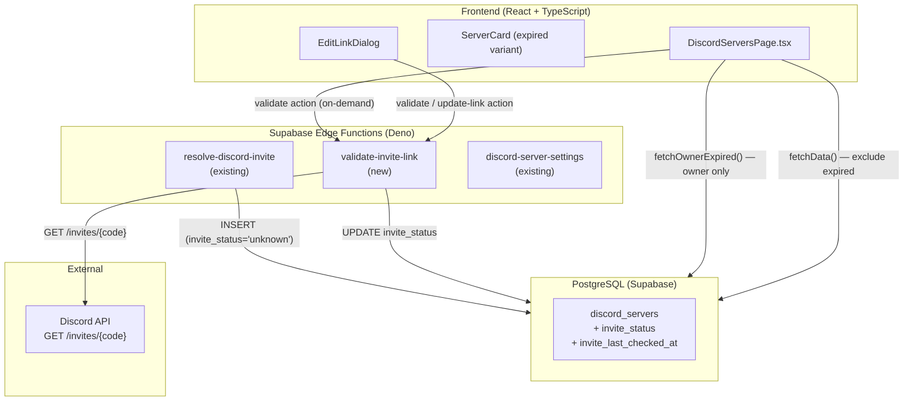

# Design Document: Discord Invite Link Validator

## Overview

ฟีเจอร์นี้เพิ่มระบบตรวจสอบความถูกต้องของ invite link สำหรับ Discord servers ที่ลงทะเบียนในระบบ Bear Cafe โดยมีเป้าหมายหลักสามประการ:

1. **ตรวจสอบสถานะ** — Edge Function ใหม่ `validate-invite-link` ทำหน้าที่ตรวจสอบ invite code กับ Discord API และอัปเดตสถานะในฐานข้อมูล
2. **ซ่อนลิงก์ที่หมดอายุ** — Query ระดับ DB กรอง `invite_status = 'expired'` ออกจาก public listing; เจ้าของเห็นเซิร์ฟเวอร์ของตัวเองในส่วนแยกต่างหาก
3. **อัปเดตลิงก์ใหม่อย่างปลอดภัย** — ตรวจสอบ Guild ID ก่อนอัปเดต เพื่อป้องกันการสลับเซิร์ฟเวอร์

ระบบออกแบบให้ทำงานร่วมกับ architecture ที่มีอยู่ (Supabase Edge Functions + RLS + React frontend) โดยไม่ต้องเปลี่ยนแปลง infrastructure หลัก

---

## Architecture



**การตัดสินใจสำคัญ: สร้าง Edge Function ใหม่ `validate-invite-link`**

เหตุผลที่ไม่ขยาย `discord-server-settings`:
- `discord-server-settings` ผูกกับ `server_discord_id` (Guild ID) ไม่ใช่ `server_id` (UUID ใน DB)
- Logic การตรวจสอบ invite มีความซับซ้อนของตัวเอง (rate limit handling, batch mode, Guild ID matching)
- การแยก function ทำให้ test ได้ง่ายกว่าและ single responsibility ชัดเจน

**Owner section: separate query ไม่ใช่ client-side filter**

เหตุผล: ป้องกัน expired server data รั่วไปยัง non-owner ผ่าน network response แม้จะซ่อนใน UI

---

## Components and Interfaces

### 1. Edge Function: `validate-invite-link`

**Path:** `supabase/functions/validate-invite-link/index.ts`

รองรับสอง action ผ่าน request body:

#### Action: `validate` (on-demand single server)

```typescript
// Request
interface ValidateRequest {
  action: "validate";
  server_id: string; // UUID ใน discord_servers
}

// Response (success)
interface ValidateResponse {
  success: true;
  invite_status: "valid" | "expired";
  invite_last_checked_at: string; // ISO timestamp
}

// Response (error)
interface ValidateErrorResponse {
  error: string;
  code?: "NOT_FOUND" | "NO_INVITE_URL" | "RATE_LIMITED" | "DISCORD_UNAVAILABLE";
}
```

HTTP status codes:
- `200` — validated successfully
- `400` — invalid invite URL format
- `401` — missing/invalid auth token
- `403` — caller is not owner or service-role
- `404` — server_id not found
- `422` — invite_url is null/empty
- `429` — Discord rate limited
- `503` — Discord API timeout or 5xx

#### Action: `update-link` (owner updates expired link)

```typescript
// Request
interface UpdateLinkRequest {
  action: "update-link";
  server_id: string;
  new_invite_url: string;
}

// Response (success)
interface UpdateLinkResponse {
  success: true;
  invite_status: "valid";
  invite_last_checked_at: string;
}
```

HTTP status codes:
- `200` — link updated successfully
- `400` — invalid URL format or Discord returned 404/400
- `401` — missing/invalid auth
- `403` — not owner
- `422` — Guild ID mismatch
- `429` — Discord rate limited
- `503` — Discord unavailable

#### Action: `batch` (service-role only)

```typescript
// Request
interface BatchRequest {
  action: "batch";
  server_ids?: string[]; // optional; if omitted, auto-select up to 50
}

// Response
interface BatchResponse {
  success: true;
  processed: number;
  results: Array<{
    server_id: string;
    status: "valid" | "expired" | "skipped" | "error";
    error?: string;
  }>;
  rate_limited?: boolean;
  unprocessed?: string[]; // server_ids not yet processed when rate limited
}
```

### 2. ฟังก์ชัน Helper ใน Edge Function

```typescript
// Extract invite code from various URL formats
function extractInviteCode(input: string): string | null

// Validate invite code format (2-32 alphanumeric/hyphen)
function isValidInviteCodeFormat(code: string): boolean

// Call Discord API with 5s timeout
async function resolveInvite(code: string): Promise<{
  ok: boolean;
  status: number;
  guildId?: string;
}>

// Check if caller is service-role
function isServiceRole(authHeader: string, serviceKey: string): boolean
```

### 3. Frontend: DiscordServersPage.tsx

**การเปลี่ยนแปลงใน `DiscordServer` interface:**

```typescript
interface DiscordServer {
  // ... existing fields ...
  invite_status: "valid" | "expired" | "unknown"; // new
  invite_last_checked_at: string | null;           // new
}
```

**การเปลี่ยนแปลงใน `fetchData()`:**

```typescript
// Public query — exclude expired (non-owner)
const serverRes = await supabase
  .from("discord_servers")
  .select("*")
  .eq("status", "approved")
  .neq("invite_status", "expired")  // ← เพิ่ม
  .order("bumped_at", { ascending: false });

// Owner expired query — separate fetch
const ownerExpiredRes = isAuthenticated
  ? await supabase
      .from("discord_servers")
      .select("*")
      .eq("status", "approved")
      .eq("invite_status", "expired")
      .eq("owner_id", user.discord_id)
  : { data: [] };
```

**State ใหม่:**

```typescript
const [ownerExpiredServers, setOwnerExpiredServers] = useState<DiscordServer[]>([]);
const [editLinkServer, setEditLinkServer] = useState<DiscordServer | null>(null);
const [isEditLinkOpen, setIsEditLinkOpen] = useState(false);
const [newInviteUrl, setNewInviteUrl] = useState('');
const [isUpdatingLink, setIsUpdatingLink] = useState(false);
```

### 4. Component: `ExpiredServerCard`

Variant ของ `ServerCard` สำหรับแสดงในส่วน owner-only:

```tsx
interface ExpiredServerCardProps {
  server: DiscordServer;
  onEditLink: (server: DiscordServer) => void;
}
```

แสดง:
- Warning badge "ลิงก์หมดอายุ" (สีส้ม/แดง พร้อม `AlertTriangle` icon)
- ข้อมูลเซิร์ฟเวอร์ (ชื่อ, icon, description) แบบ dimmed
- ปุ่ม "แก้ไขลิงก์" (primary action)

### 5. Component: `EditLinkDialog`

Dialog สำหรับเจ้าของกรอก invite link ใหม่:

```tsx
interface EditLinkDialogProps {
  server: DiscordServer | null;
  open: boolean;
  onOpenChange: (open: boolean) => void;
  onSuccess: (serverId: string) => void;
}
```

Flow:
1. เปิด dialog → re-check `invite_status` จาก DB ก่อน
2. ถ้า status ไม่ใช่ `expired` → ปิด dialog + แสดง toast "ลิงก์ไม่ได้หมดอายุแล้ว"
3. ถ้า status ยังเป็น `expired` → แสดง input field
4. Submit → เรียก `validate-invite-link` action `update-link`
5. Success → อัปเดต state, ย้ายเซิร์ฟเวอร์จาก expired section ไป public listing

---

## Data Models

### Migration: เพิ่มคอลัมน์ใหม่

**File:** `supabase/migrations/YYYYMMDDHHMMSS_add_invite_status_columns.sql`

```sql
-- Add invite_status column with check constraint
ALTER TABLE public.discord_servers
  ADD COLUMN IF NOT EXISTS invite_status text
    NOT NULL DEFAULT 'unknown'
    CHECK (invite_status IN ('valid', 'expired', 'unknown'));

-- Add invite_last_checked_at column
ALTER TABLE public.discord_servers
  ADD COLUMN IF NOT EXISTS invite_last_checked_at timestamptz DEFAULT NULL;

-- Backfill existing rows (already handled by DEFAULT 'unknown')
-- Explicit update for safety in case DEFAULT was not applied
UPDATE public.discord_servers
  SET invite_status = 'unknown'
  WHERE invite_status IS NULL;

-- Index for efficient filtering of non-expired servers
CREATE INDEX IF NOT EXISTS idx_discord_servers_invite_status
  ON public.discord_servers(invite_status, bumped_at DESC)
  WHERE status = 'approved';

-- Index for batch job: find servers needing validation
CREATE INDEX IF NOT EXISTS idx_discord_servers_needs_validation
  ON public.discord_servers(invite_last_checked_at NULLS FIRST)
  WHERE status = 'approved' AND invite_status != 'expired';
```

### ตาราง `discord_servers` (หลังเพิ่มคอลัมน์)

| Column | Type | Default | Constraint |
|--------|------|---------|------------|
| `invite_status` | `text` | `'unknown'` | `CHECK (invite_status IN ('valid', 'expired', 'unknown'))` |
| `invite_last_checked_at` | `timestamptz` | `NULL` | — |

### RLS Policy

ไม่ต้องเพิ่ม RLS policy ใหม่สำหรับคอลัมน์เหล่านี้ เพราะ:
- การอ่าน: ใช้ policy เดิม (public read สำหรับ approved servers)
- การเขียน: `validate-invite-link` ใช้ `service_role` client ซึ่ง bypass RLS

อย่างไรก็ตาม ต้องเพิ่ม policy สำหรับ owner query ที่ต้องการดู expired servers ของตัวเอง:

```sql
-- Allow owners to read their own expired servers
-- (existing "Allow owners to manage all servers" policy covers SELECT already)
-- No new policy needed — existing owner policy handles this
```

### `resolve-discord-invite` — การเปลี่ยนแปลง

เมื่อ insert server ใหม่ ให้ set `invite_status = 'unknown'` (ซึ่งเป็น default แล้ว ไม่ต้องเปลี่ยน code)

---

## Correctness Properties

*A property is a characteristic or behavior that should hold true across all valid executions of a system — essentially, a formal statement about what the system should do. Properties serve as the bridge between human-readable specifications and machine-verifiable correctness guarantees.*

### Property 1: Invite Code Extraction is Format-Invariant

*For any* valid invite code string `c` consisting of 2–32 alphanumeric or hyphen characters, extracting the code from `https://discord.gg/{c}`, `https://discord.com/invite/{c}`, `https://discordapp.com/invite/{c}`, and the bare string `{c}` SHALL all produce the same code `c`.

**Validates: Requirements 7.1**

### Property 2: Invite Code Round-Trip via Canonical URL

*For any* valid invite code `c` extracted from any supported URL format, constructing the canonical URL `https://discord.gg/{c}` and re-extracting the code from that canonical URL SHALL produce `c` unchanged.

**Validates: Requirements 7.1, 7.2**

### Property 3: Invalid Code Format is Always Rejected Without Calling Discord API

*For any* string that does not match the pattern `^[a-zA-Z0-9-]{2,32}$` (after stripping known URL prefixes), the invite code extractor SHALL return `null`, and the validator SHALL return HTTP 400 without making any call to the Discord API.

**Validates: Requirements 6.9, 7.5**

### Property 4: Public Listing Never Contains Expired Servers

*For any* set of approved servers in the database with mixed `invite_status` values, the public listing query SHALL return only servers where `invite_status` is `'valid'` or `'unknown'` — never a server where `invite_status` is `'expired'`.

**Validates: Requirements 2.1, 2.2, 4.1, 4.2**

### Property 5: Owner Expired Query Returns Only That Owner's Expired Servers

*For any* authenticated user with `discord_id = U`, the owner-specific expired server query SHALL return only servers where `owner_id = U` AND `invite_status = 'expired'` — never servers owned by a different user, and never servers with a non-expired status.

**Validates: Requirements 2.3, 4.3, 4.4**

### Property 6: Guild ID Matching Correctly Determines Update Outcome

*For any* server record with `discord_id = G` and any new invite link that resolves (via mocked Discord API) to Guild ID `G'`: if `G === G'` the update SHALL succeed and set `invite_status = 'valid'`; if `G !== G'` the update SHALL be rejected with HTTP 422 and the database SHALL remain unchanged.

**Validates: Requirements 6.2, 6.3, 7.3, 7.4**

### Property 7: Batch Validation Processes Only Stale or Unchecked Servers

*For any* collection of approved servers with varying `invite_status` and `invite_last_checked_at` values, the batch validation job SHALL process only servers where `invite_status = 'unknown'` OR `invite_last_checked_at` is older than 24 hours from the batch start time — never servers that were recently validated.

**Validates: Requirements 8.2**

---

## Error Handling

### Discord API Errors

| Discord Status | Validator Behavior | DB Update |
|---|---|---|
| `200` | Set `invite_status = 'valid'`, update `invite_last_checked_at` | ✅ |
| `404` / `400` | Set `invite_status = 'expired'`, update `invite_last_checked_at` | ✅ |
| `429` (rate limit) | Return HTTP 429, leave DB unchanged | ❌ |
| `5xx` | Return HTTP 503, leave DB unchanged | ❌ |
| Timeout (>5s) | Return HTTP 503, leave DB unchanged | ❌ |

### Batch Mode Error Handling

```
for each server_id in batch:
  if server not found → skip, record "skipped"
  if invite_url is null → skip, record "skipped"
  call Discord API:
    200 → update valid, record "valid"
    404/400 → update expired, record "expired"
    429 → STOP batch, return partial result with unprocessed list
    5xx/timeout → record "error", continue to next server
```

### Frontend Error States

| Scenario | UI Response |
|---|---|
| Re-check before edit dialog: network error | Toast error "ไม่สามารถตรวจสอบสถานะได้" — dialog ไม่เปิด |
| Re-check: status no longer expired | Toast info "ลิงก์ใช้งานได้แล้ว" — dialog ไม่เปิด |
| Update link: Guild ID mismatch (422) | Toast error "ลิงก์นี้ไม่ใช่ของเซิร์ฟเวอร์เดิม" |
| Update link: invalid link (400) | Toast error "ลิงก์ไม่ถูกต้องหรือหมดอายุ" |
| Update link: rate limited (429) | Toast warning "Discord ถูก rate limit กรุณาลองใหม่ภายหลัง" |
| Update link: Discord unavailable (503) | Toast error "Discord ไม่ตอบสนอง กรุณาลองใหม่" |

---

## Testing Strategy

### Dual Testing Approach

ใช้ทั้ง unit/example tests และ property-based tests ร่วมกัน:
- **Unit tests** — ทดสอบ specific examples, edge cases, error conditions
- **Property tests** — ทดสอบ universal properties ด้วย random inputs (100+ iterations)

### Property-Based Tests (fast-check สำหรับ Deno)

ใช้ [fast-check](https://github.com/dubzzz/fast-check) ผ่าน npm specifier:

```typescript
import fc from "npm:fast-check@3";
```

แต่ละ property test ต้องรัน **อย่างน้อย 100 iterations** และ tag ด้วย comment referencing design property:

```typescript
// Feature: discord-invite-link-validator, Property 1: invite code extraction is format-invariant
Deno.test("Property 1: invite code extraction is format-invariant", async () => {
  await fc.assert(
    fc.property(
      fc.stringMatching(/^[a-zA-Z0-9-]{2,32}$/),
      (code) => {
        const formats = [
          `https://discord.gg/${code}`,
          `https://discord.com/invite/${code}`,
          `https://discordapp.com/invite/${code}`,
          code,
        ];
        return formats.every((f) => extractInviteCode(f) === code);
      }
    ),
    { numRuns: 100 }
  );
});
```

**Properties ที่ implement เป็น property-based tests (pure functions, no external calls):**

| Property | Test Approach | Generator |
|---|---|---|
| **Property 1** — format invariance | PBT | `fc.stringMatching(/^[a-zA-Z0-9-]{2,32}$/)` |
| **Property 2** — canonical URL round-trip | PBT | same generator |
| **Property 3** — invalid format → 400 | PBT | `fc.string()` filtered to NOT match valid pattern |
| **Property 6** — Guild ID matching | PBT with mocked Discord API | `fc.record({ guildId: fc.string(), ... })` |
| **Property 7** — batch staleness filter | PBT | `fc.array(fc.record({ invite_status, invite_last_checked_at }))` |

**Properties ที่ใช้ integration/example tests แทน:**

| Property | เหตุผล | Test Approach |
|---|---|---|
| **Property 4** — public listing filter | ต้องทดสอบ DB query + RLS | Integration test กับ Supabase test instance |
| **Property 5** — owner isolation | ต้องทดสอบ RLS policy | Integration test กับ Supabase test instance |

### Unit Tests (Deno / `Deno.test`)

ทดสอบ pure functions และ edge cases ใน `validate-invite-link`:

- `extractInviteCode()` — ทุก URL format, bare code, invalid inputs (length 1, 33+, special chars)
- `isValidInviteCodeFormat()` — boundary: length 2 (valid), length 1 (invalid), length 32 (valid), length 33 (invalid)
- `isServiceRole()` — valid/invalid service key comparison
- HTTP status mapping: Discord 200 → `'valid'`, 404/400 → `'expired'`, 429 → unchanged, 5xx → unchanged
- Auth checks: missing token → 401, non-owner → 403, service-role → allowed
- Batch result aggregation: partial results when rate limited

### Integration Tests

- `validate-invite-link` action `validate` กับ Discord API จริง (invite code ที่รู้ว่า valid/expired)
- `validate-invite-link` action `update-link` กับ Guild ID ที่ตรงและไม่ตรง
- Batch mode: ทดสอบ partial result เมื่อถึง rate limit (mock Discord API)
- DB query: ยืนยัน `neq('invite_status', 'expired')` filter ทำงานถูกต้อง

### Frontend Tests (Vitest + React Testing Library)

- `ExpiredServerCard` render ถูกต้อง (warning badge "ลิงก์หมดอายุ", ปุ่ม "แก้ไขลิงก์")
- `EditLinkDialog` flow: re-check → expired → submit → success → server ย้ายไป public list
- `EditLinkDialog` flow: re-check → not expired → dialog ไม่เปิด + toast แสดง
- `EditLinkDialog` flow: re-check → network error → dialog ไม่เปิด + error toast
- `FeaturedCarousel` ไม่แสดง server ที่ `invite_status = 'expired'`
- ปุ่ม "แก้ไขลิงก์" ไม่แสดงสำหรับ non-owner
